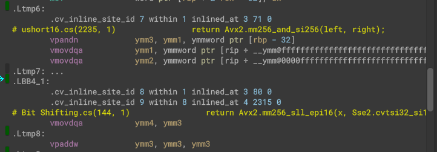

# scanline-floodfill
A fast floodfill algorithm utilizing full AVX2 256-bit registers, AVX2 bitwise operators and burst. Made to be used in a larger HPA* pathfinding solution.

Burst vectorization:

Above gif is a small demonstration how it executes. In reality it executes in 16x16 bit chunks.

Dependencies:
- [MaxMath](https://www.github.com/MrUnbelievable92/MaxMath)
